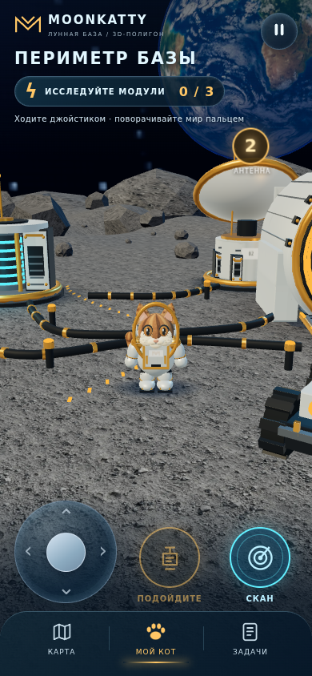
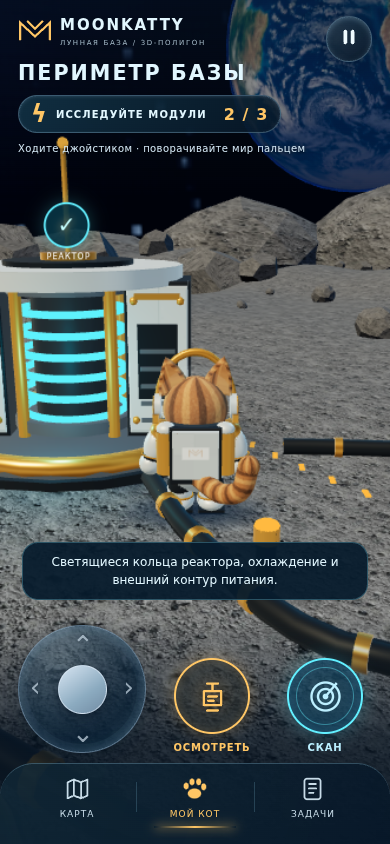
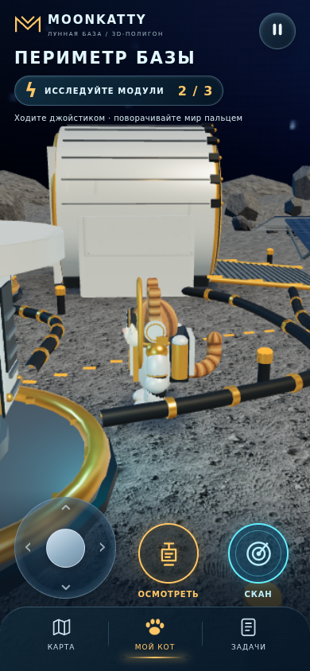
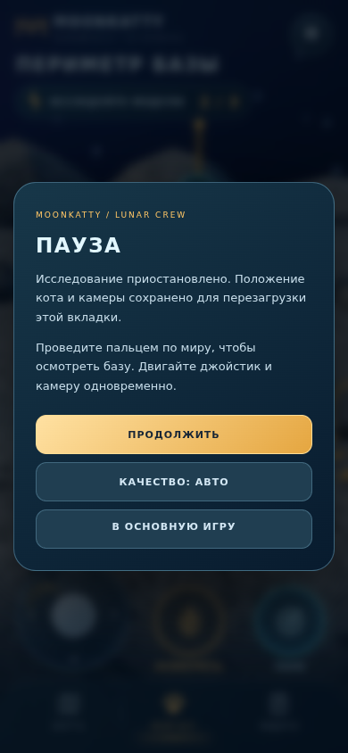
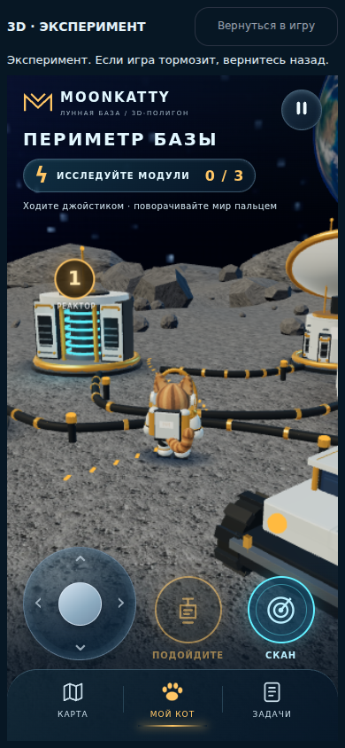

# Open 3D lunar-base sample — current validation evidence

Checked 10 October 2026. Production base: main
`00e391ffe0bb2ed663a7e3136cf382b0030857b4` (PR60).
Graphics PR59: `feat/lunar-expedition-20261010`.
Final playable source checkpoint: `bd8636b827f6a708ea756033068aeac8a65f5d41`.

## What is actually built

One actual WebGL2 location with continuous analog walking, an animated full-volume
brown tabby astronaut, 360° camera orbit, colliding rocks/equipment, an open
airlock/ramp, reactor, relay, generator, rover, solar array, scanner, map, tasks
and three local inspections. The cyan reactor core is no longer hidden behind
an opaque cylinder. Terrain/rock texture, distant ridges, metal seams/clamps,
solar cells, hoses, rover cabin/tire tracks and the mascot's gold insignia have
been refined. This is a bounded first location, not a finished nine-chapter 3D
campaign. The procedural mascot and lighting still fall short of the cinematic
reference; this document does not award a 9/10 or declare release readiness.

Run from the repository root with `python3 -m http.server 8000` and open
`http://localhost:8000/graphics-preview/`.

## Production boundary and interrupted work

All **329 files already tracked by the published main remain byte-identical**.
Auth/account switching, stage retries, Convoy restoration, rewards, backend,
campaign controllers and save formats were not edited. Compressed writes remain
explicitly disabled (`traceTransport:false`). The sample does not load campaign
controllers or call game APIs. Its own per-tab sessionStorage position/camera/
inspection data never grants or migrates campaign progress.

No service-level reason for the interrupted chat run is available. Git history,
saved source and test evidence survived. Earlier interrupted local long tests
were completed. A separate reproducible PR61 CI test failure was diagnosed below;
that is not proof of why the chat itself stopped.

## Tests and evidence

`main-regression.json` maps all **77 existing main test programs** to passing
results. The earlier long `story.cjs` and `worlds.cjs` runs completed in the resumed
log; no existing main test or runner was weakened. The graphics checkpoint
`7aa18d79026755bf0ac7b93e9ef4685b2c2dd8a5` passed the full GitHub suite in
[run 38071929789](https://github.com/moonkattymky/moonkatty-game/actions/runs/38071929789).
The next checkpoint changes only the mascot's insignia and compatibility docs;
its full CI is tracked separately and must be checked before publication.

The final actual-render test **passes all 17 scenario groups** on **seven layouts**
(320×568, 360×640, 390×844, 430×932, 568×320, 844×390, 768×1024), with no JavaScript
errors. `graphics-regression.json` records source SHA, hit targets and results.
It uses actual keyboard/native touch events, not teleports or state setters:
continuous camera-relative walking, simultaneous walking/looking, pinch/cancel,
collision, all three inspections reached by walking, full orbit and outdoor
camera clearance, pause input barrier, map/tasks, reload, untouched campaign
storage/API boundary, BFCache lifecycle, backgrounding, economy mode, lost GPU
context and failed-asset recovery. Controls retain 44 px minimum hit areas and
unobstructed mobile/landscape targets. Telegram SDK viewport, BackButton and
deactivation use a synthetic fixture; a signed-in physical Telegram client was
not tested.

The first-load sample resources total **1,462,601 bytes** before HTTP
compression. The regression viewpoint renders 69 draw calls /
108,752 triangles; counts vary with viewpoint.

## Fresh isolated software-WebGL performance

`performance-software-webgl.json` measures the final source in Chromium
145.0.7632.6, ANGLE/SwiftShader, viewport 390×844, device scale 2, adaptive render
ratio 0.85. No other WebGL workload runs concurrently. Cold cache uses 4 Mbit/s,
150 ms latency and 4× CPU throttling; interaction restores CPU rate 1 and removes
network throttling. All frame stalls remain in the sample. Percentiles use nearest
rank. Six input trials include automation dispatch/polling overhead.

| Measurement | Result in this environment |
| --- | --- |
| Ready after cold load | 8,943 ms |
| Frame interval p50 / p95 | 183.4 / 450.0 ms (46 samples) |
| Input to first observed movement p50 / p95 | 251.2 / 1249.1 ms (6 samples) |
| Benchmark viewpoint | 75 draw calls / 109,968 triangles |
| JavaScript errors | 0 |

These results **do not pass smooth-play release criteria on this software
renderer** and must not be represented as phone performance. Do not infer an FPS
improvement from two short runs on this variable host. Full-scene shadow sampling
is removed; terrain AO/vertex lighting, station instancing, per-rig-part mesh
merging and fewer invisible subdivisions reduce rendering work without changing
colliders, floor height, walking or preview saves.

`RENDERER_PROPOSAL.md` and `renderer-readback-diagnostic.json` identify the MSAA
framebuffer's cost in an isolated 12-frame diagnostic with synchronous pixel
readback. These are render/readback timings, not gameplay/phone FPS. The shared
`world.js` antialias option remains unchanged pending PR61/logic coordination;
its pause/dispose/loading hooks must be retained.

Physical-device acceptance remains open: median frame ≤33.3 ms / p95 ≤50 ms,
touch response median ≤100 ms / p95 ≤200 ms, a 10-minute walk/orbit session inside
Telegram on representative Android/iPhone, minimize/return, orientation/safe
areas, simultaneous walking/look, pause, reload and sustained performance.

## PR61 compatibility — concrete review proposal

PR61 remains separate, head `3779a5f0424751a3b2eab0ab4479186fedae24d1`.
A detached compatibility build overlays **only scene.js and world.css**, preserving
PR61's root entry and world.js lifecycle. The unchanged PR61 baseline reproduces
its reload-test TypeError because Navigation Timing is empty; the same error is
present in [run 38071207661](https://github.com/moonkattymky/moonkatty-game/actions/runs/38071207661)
(79/80 full-suite result). No browser-cause diagnosis is claimed.

With the exact proposed patch in `PR61_REVIEW_PATCH.diff`, the combined graphics
build passes both entry source/UI tests (**2/2**), including account/save reload,
close while loading, return/reopen and narrow/landscape hosting. Only two reviewed
visual asset hashes change; all other frozen files and storage/account checks stay
intact. Root reload is proven with the main-frame navigation event and successful
network navigation response, replacing the unavailable timing entry. See
`PR61_COMPATIBILITY.md`, the baseline/passing logs and synthetic-fixture report.
This proposal is **not applied to PR61** and has not been claimed as delivered to
or agreed with the other chat. The full 80-test combined candidate is not claimed
as completed; it must run after the entry/test patch is approved and integrated.

## Actual screenshots and recording

The PNGs and **84.4-second MP4** are captured from the actual local
build at 390×844 with native touch. Footage shows walking to the generator and
reactor, inspection, pinch, >360° orbit, map, pause/resume and further walking.
Only initial loading is trimmed; playback speed is unchanged. The MP4's 25 fps
container rate is not measured render FPS. `capture.json` includes source hashes,
video hash and capture state. The MP4 is delivered separately and under `review/`
in the source backup. Capture/benchmark helpers reproduce the procedure.

## Publication and remaining work

PR59 remains a draft; main and production Pages have not been overwritten or
published by this work. Before publication, review the latest main/PR61, retain
all approved controller lifecycle changes, coordinate the shared renderer option,
complete the full combined tests and physical Telegram acceptance. Then verify
actual deployed resources and cache/version behavior. Expand other 3D locations
only after this one passes device acceptance and its visual style is approved.

Rollback is additive: revert graphics-only additions while keeping newer logic
fixes. No save migration is required. Editable scene/rig, texture originals,
pinned engine license, tests, measurements and recording helpers are preserved.

